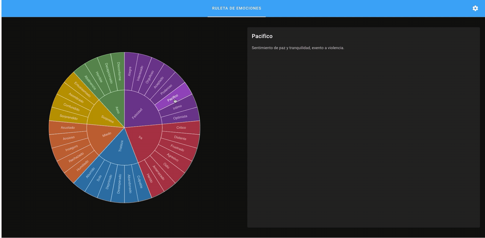

# Emotions wheel
This is a side project built with the purpose of helping anyone that wants to identify their emotions, you can define the emotions in a JSON file and then visualize it in the following wheel as shown in the following gift.



Multiple languages and dark mode is supported.

#### Note: The definitions need more refinement, I will keep improving them and I plan to add more references over time, feel free to open a pull request to add more languages or to improve the descriptions or add more emotions

## Project setup
```
npm install
```

### Compiles and hot-reloads for development
```
npm run serve
```

### Compiles and minifies for production
```
npm run build
```

### Run your unit tests
```
npm run test:unit
```

### Lints and fixes files
```
npm run lint
```

### Customize configuration
See [Configuration Reference](https://cli.vuejs.org/config/).
